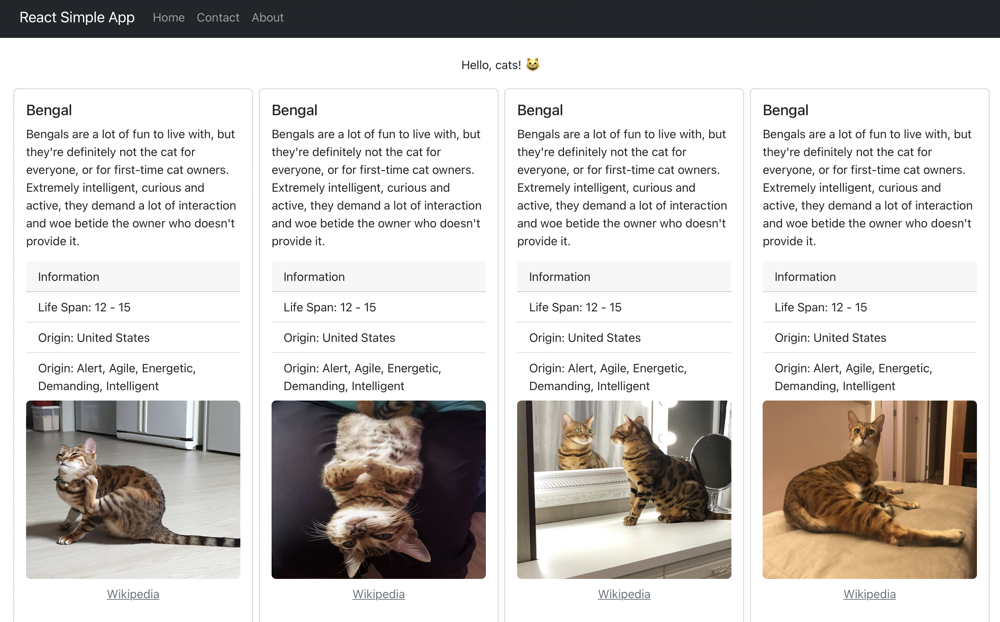

# Simple React WebApp - TheCatAPI

The app uses [React Bootstrap](https://github.com/react-bootstrap/react-bootstrap) and [TheCatAPI](https://thecatapi.com) service 😺

## 📺 Videos

*Lean how to build a simple ReactJS app 🚀*

### Part 1

[![Watch the video][video1-thumbnail]](https://www.youtube.com/watch?v=kUR3XAFR3K0)

👉 **[Click here to watch on YouTube, live coding, part 1](https://www.youtube.com/watch?v=kUR3XAFR3K0)**

### Part 2

[![Watch the video][video2-thumbnail]](https://www.youtube.com/watch?v=d0IHEn5GeGU)

👉 **[Click here to watch on YouTube, live coding, part 2](https://www.youtube.com/watch?v=d0IHEn5GeGU)**

### Part 3

[![Watch the video][video3-thumbnail]](https://www.youtube.com/watch?v=e4Z5AhreKTc)

👉 **[Click here to watch on YouTube, live coding, part 3](https://www.youtube.com/watch?v=e4Z5AhreKTc)**

## 🖼 Preview

## ⚙️ Setting Up

1. Make sure you have npm v6 or newer installed (by installing [NodeJS](https://nodejs.org/en/download)).
2. Run `npm ci` to install all dependencies.
3. `npm start` to start your React client application.

## 🧑‍🎨 Author

I'm [Pierre-Henry Soria](https://ph7.me), a SUPER passionate and enthusiastic software engineer 🤖

I love reading too (non-fiction books), and learning new things every single day!

I'm also the founder of [pH7's Social Dating Builder 🚀](https://github.com/pH7Software/pH7-Social-Dating-CMS) and hundreds of other open source projects like [Lifyzer, Healthy Food 🍍](https://github.com/Lifyzer) and [others](https://github.com/pH-7?tab=repositories).

[![LinkedIn][linkedin-image]](https://www.linkedin.com/in/ph7enry/ "Pierre-Henry Soria - Connect on LinkedIn") [![pH-7][github-image]](https://github.com/pH-7 "Follow Me on GitHub") [![@phenrysay][twitter-image]](https://twitter.com/phenrysay "Follow Me on Twitter")

## ⚖️ License

Distributed under [MIT](https://opensource.org/licenses/MIT) license 🎉

<!-- GitHub's Markdown reference links -->
[video1-thumbnail]: https://i1.ytimg.com/vi/kUR3XAFR3K0/maxresdefault.jpg
[video2-thumbnail]: https://i1.ytimg.com/vi/d0IHEn5GeGU/maxresdefault.jpg
[video3-thumbnail]: https://i1.ytimg.com/vi/e4Z5AhreKTc/maxresdefault.jpg

[github-image]: https://img.shields.io/badge/GitHub-100000?style=for-the-badge&logo=github&logoColor=white
[twitter-image]: https://img.shields.io/badge/Twitter-1DA1F2?style=for-the-badge&logo=twitter&logoColor=white
[linkedin-image]: https://img.shields.io/badge/LinkedIn-0077B5?style=for-the-badge&logo=linkedin&logoColor=white

